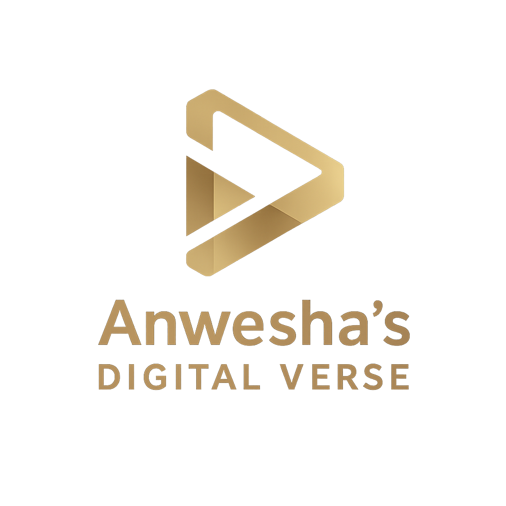

# Anwesha's Digital Verse — Official Website



> **Your Digital Growth Partner** — Digital Marketing & Technology Solutions Agency based in Kolkata, India.

🌐 **Live Website**: [anweshasdigitalverse.in](https://anweshasdigitalverse.in)

---

## 📋 Overview

Anwesha's Digital Verse is a full-service digital marketing and technology solutions agency. This repository contains the complete source code for the official website — a multi-page, responsive, SEO-optimized website built with pure HTML, CSS, and JavaScript.

---

## 🗂️ Project Structure

```
ADV_web/
├── index.html            # Home page — hero, services overview, CTA
├── services.html         # Services page — all 8 services detailed + process
├── tech-solutions.html   # Tech Solutions — App Dev, CRM, HRMS deep-dive
├── about.html            # About page — story, values, why choose us
├── contact.html          # Contact page — form, info, Google Maps
├── styles.css            # Shared stylesheet (all pages)
├── script.js             # Shared JavaScript (nav, animations, form)
├── logo.png              # Brand logo
├── sitemap.xml           # XML sitemap for search engines
├── robots.txt            # Crawler directives
└── README.md             # This file
```

---

## 🛠️ Services Offered

| # | Service | Description |
|---|---------|-------------|
| 1 | 📣 Social Media Marketing | Facebook & Instagram Ads, Content Strategy, Branding |
| 2 | 💻 Website Development | Business Websites, Landing Pages, E-commerce, SEO |
| 3 | 📱 App Development | Android & iOS, React Native, Flutter, E-commerce Apps |
| 4 | ⚙️ Customised CRM Development | Lead Management, Sales Pipeline, Dashboards, Integrations |
| 5 | 🏢 HRMS Development | Employee Management, Payroll, Attendance, Leave, Reviews |
| 6 | 📈 Digital Strategy & Consulting | Brand Positioning, Competitor Analysis, Growth Roadmap |
| 7 | 🎨 Content & Creative | Graphic Design, Reels & Video, Copywriting, Brand Identity |
| 8 | 🔍 SEO & Lead Generation | On-Page/Off-Page SEO, Google My Business, Lead Funnels |

---

## 🚀 Tech Stack

| Technology | Usage |
|---|---|
| HTML5 | Semantic page structure |
| CSS3 | Styling, animations, responsive design |
| JavaScript (Vanilla) | Mobile nav, scroll reveal, form handling |
| Google Fonts | Cormorant Garamond + Outfit |
| Formspree | Contact form backend (AJAX) |
| Schema.org JSON-LD | Structured data for SEO |

---

## 🔍 SEO Features

- ✅ Unique `<title>` and `<meta description>` per page
- ✅ Targeted `<meta keywords>` per page
- ✅ Open Graph tags (Facebook, LinkedIn, WhatsApp previews)
- ✅ Twitter Card tags
- ✅ Canonical URLs to prevent duplicate content
- ✅ JSON-LD structured data (Organization, Service, AboutPage, ContactPage)
- ✅ `sitemap.xml` for Google Search Console
- ✅ `robots.txt` with sitemap reference
- ✅ Favicon support
- ✅ Semantic HTML structure
- ✅ Mobile-responsive design (Google mobile-first indexing)

---

## 📱 Responsive Design

The website is fully responsive across all devices:

- **Desktop** (1200px+) — Full layout with side-by-side grids
- **Tablet** (600px–900px) — Single column layout, mobile nav
- **Mobile** (<600px) — Stacked layout, hamburger menu, touch-friendly buttons

---

## 📞 Contact Information

| Channel | Details |
|---|---|
| 📞 Phone / WhatsApp | [8017586675](https://wa.me/918017586675?text=Hi%21%20I%20want%20to%20know%20more.) |
| 📍 Location | Kolkata, West Bengal, India |
| 🕐 Working Hours | Mon–Sat, 10 AM – 7 PM |
| 📘 Facebook | [Anwesha's Digital Verse](https://www.facebook.com/share/1BuCzvMi6v/) |
| 📸 Instagram | [@anweshasdigitalverse](https://www.instagram.com/anweshasdigitalverse) |

---

## 🖥️ Local Development

1. Clone or download this repository
2. Open `index.html` in any modern browser
3. No build tools or server required — it's pure HTML/CSS/JS

```bash
# Simply open in browser
open index.html
```

> **Note**: The contact form requires an internet connection as it uses [Formspree](https://formspree.io) for form submissions.

---

## 📝 Deployment

Upload all files to your web hosting provider (e.g., Hostinger, GoDaddy, Netlify, Vercel):

1. Upload all files to the `public_html` or root directory
2. Ensure `index.html` is the default document
3. Submit `sitemap.xml` to [Google Search Console](https://search.google.com/search-console)
4. Verify `robots.txt` is accessible at `yourdomain.in/robots.txt`

---

## 📄 License

© 2026 **Anwesha's Digital Verse**. All rights reserved.

This website and its content are proprietary. Unauthorized reproduction or distribution is prohibited.

---

<p align="center">
  Built with ❤️ in Kolkata, India<br/>
  <strong>Anwesha's Digital Verse</strong> — Your Digital Growth Partner
</p>
